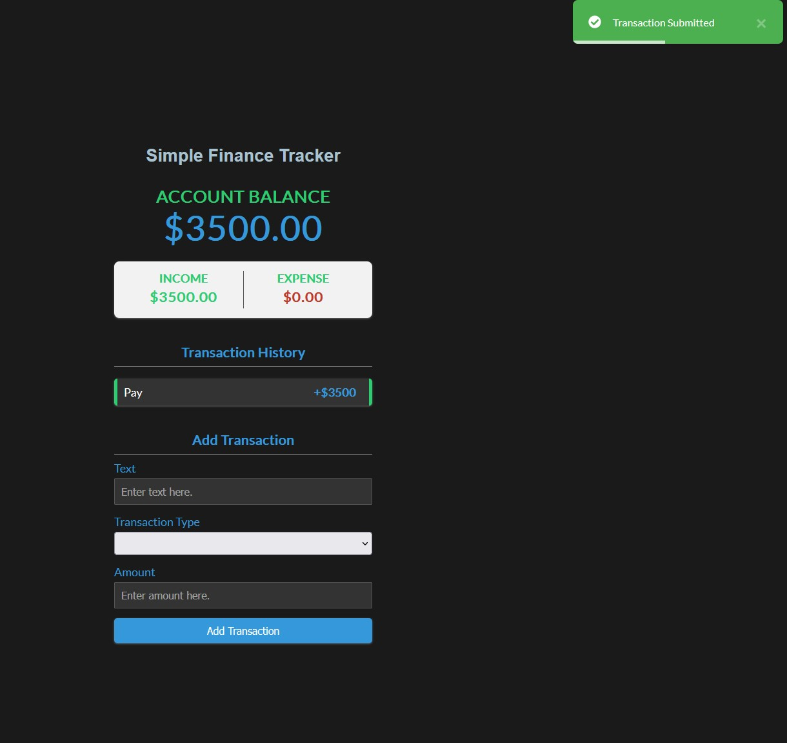

## Simple Finance Tracker


# vue-project

This template should help get you started developing with Vue 3 in Vite.

## Recommended IDE Setup

[VSCode](https://code.visualstudio.com/) + [Volar](https://marketplace.visualstudio.com/items?itemName=Vue.volar) (and disable Vetur) + [TypeScript Vue Plugin (Volar)](https://marketplace.visualstudio.com/items?itemName=Vue.vscode-typescript-vue-plugin).

## Customize configuration

See [Vite Configuration Reference](https://vitejs.dev/config/).

## Project Setup

```sh
npm install
```

### Compile and Hot-Reload for Development

```sh
npm run dev
```

### Compile and Minify for Production

```sh
npm run build
```
# Vue Finance App

This template serves as the foundation for developing a finance management application using Vue 3 and Vite. The application helps users track their income, expenses, and overall account balance.

## Features

- **Transaction Tracking:** Record and view a list of transactions including the name, amount, and type (income or expense).
- **Account Balance:** Monitor your account balance in real-time, factoring in both income and expenses.
- **Category-wise Summaries:** Track income and expenses separately, providing a clear overview of financial activities.
- **User-Friendly Interface:** Intuitive and easy-to-use interface for seamless navigation and data entry.

## Technology Stack

- **Vue 3:** A progressive JavaScript framework for building user interfaces.
- **Vite:** A next-generation front-end tool that provides a faster development experience.
- **TypeScript:** A statically typed superset of JavaScript for enhanced code quality and development productivity.

## Recommended IDE Setup

- **Visual Studio Code (VSCode):** A powerful code editor for optimal development experience.
- **Volar Extension:** Vue 3 language support extension for VSCode.
- **TypeScript Vue Plugin (Volar):** TypeScript support for Vue 3.

## Project Setup

Install dependencies:

```sh
npm install
```
## How to use
- **Clone this repository to your local machine.**
- **Install dependencies using npm install.**
- **Run the development server with npm run dev.**
- **Open the application in your browser and start managing your finances!**

